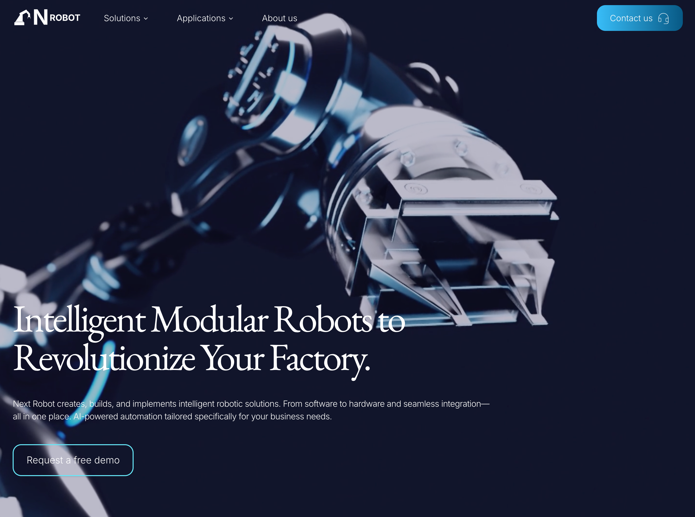

# NextRobot

NextRobot is a web application designed to sell rebot arms and providing info about robots.



[Live Demo](https://next-robot-app.vercel.app/)

## Features

- **Modern UI** – A sleek and intuitive user interface designed for a seamless and engaging user experience, ensuring smooth navigation across the app.
- **Responsive UI** – Optimized for both desktop and mobile devices, providing flexibility for remote monitoring and control.
- **Product Listings** – Browse available robotic arms with descriptions, technical specifications, and images.
- **Contact Form** – A contact form integrated with NodeMailer to allow users to send inquiries directly to the platform's support team for assistance or queries.


## Getting Started

### Prerequisites

Ensure you have Node.js and a package manager installed (npm, yarn, pnpm, or bun).

### Installation

Clone the repository and install dependencies:

```bash
git clone https://github.com/MSaeedMp/next-robot-app.git
cd next-robot-app
npm install  # or yarn install or pnpm install or bun install
```
